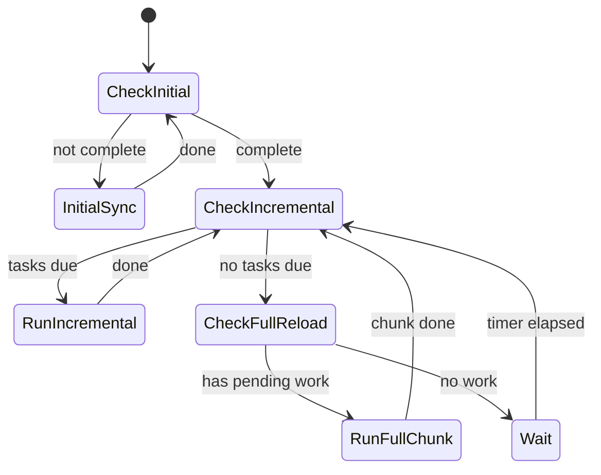

# Архитектура синхронизации с Business.ru

## Обзор

Система синхронизации построена на **приоритетной модели** с тремя уровнями:

| Приоритет | Название | Поведение |
|-----------|----------|-----------|
| ⚡ **FORCE** | Daily/Force Full Resync | **Высший приоритет (Parallel State).** По расписанию. Выполняется через день после Initial state (имеет свои курсоры). |
| 🔴 **HIGH** | Initial (First Run) | Блокирующий. Выполняется, если `InitialComplete` = false. |
| 🟡 **MEDIUM** | Incremental | По интервалам. Выполняется, если нет FORCE/HIGH задач. |
| 🟢 **LOW** | Full Reload | Каждый день в 01:00 МСК. |

> [!NOTE]
> **Разделение состояния**: `Daily Sync` имеет свой собственный набор курсоров (`Daily_Groups_Complete`, `Daily_Goods_Page` и т.д.).
> Ежедневный запуск **НЕ сбрасывает** флаг `InitialComplete` и не влияет на исторический факт первичной загрузки.
> При начале нового ежедневного цикла, состояние `Daily_*` сбрасывается в ноль, и процесс идет независимо.

---

## Модель приоритетов

```
┌─────────────────────────────────────────────────────────────────┐
│ ⚡ FORCE: Daily Full Resync (Parallel State)                    │
├─────────────────────────────────────────────────────────────────┤
│ • Использует ключи: Daily_Groups_Complete, Daily_Goods_Page...  │
│ • Запускается каждый день в 01:00 МСК (проверка DailyStartedAt) │
│ • Если цикл не завершен, продолжит с места остановки            │
│ • Если наступил новый день - сбросит DailyState и начнет заново │
└─────────────────────────────────────────────────────────────────┘
                              ↓
┌─────────────────────────────────────────────────────────────────┐
│ 🔴 HIGH: Initial Sync (First Run)                               │
├─────────────────────────────────────────────────────────────────┤
│ • Использует ключи: Initial_Groups_Complete, Initial_Goods_Page │
│ • Запускается один раз, если база пустая (InitialComplete=false)│
└─────────────────────────────────────────────────────────────────┘
                              ↓
                    Initial complete?
                              ↓
┌─────────────────────────────────────────────────────────────────┐
│ 🟡 MEDIUM: Incremental Updates (по интервалам)                  │
├─────────────────────────────────────────────────────────────────┤
│ • Запрос изменений с момента последнего запроса                 │
│ • Интервалы: товары (1 мин), справочники (1 день)               │
│ • Всегда выполняется перед Full Reload                     │
└─────────────────────────────────────────────────────────────────┘
                              ↓
                    Есть свободное время?
                              ↓
┌─────────────────────────────────────────────────────────────────┐
│ 🟢 LOW: Full Reload (фоновая проверка)                     │
├─────────────────────────────────────────────────────────────────┤
│ • Выполняется в промежутках, если нет других задач              │
│ • Загружает товары страницами, не блокируя систему              │
└─────────────────────────────────────────────────────────────────┘
```

---

## Алгоритм главного цикла

```csharp
while (!stopping)
{
    // 🔴 HIGH: блокирующая инициализация
    if (!await IsInitialSyncCompleteAsync())
    {
        await RunInitialSyncAsync();  // Блокируем до завершения
        continue;
    }
    
    // 🟡 MEDIUM: проверяем, есть ли просроченные incremental задачи
    var pendingIncrementals = GetDueIncrementalTasks();
    if (pendingIncrementals.Any())
    {
        foreach (var task in pendingIncrementals)
            await task.ExecuteAsync();
        continue;  // После инкрементов проверяем снова
    }
    
    // 🟢 LOW: если всё выполнено — работаем над full reload
    if (HasPendingFullReloadWork())
    {
        await RunFullReloadChunkAsync();  // N страниц
        // Не ждём, сразу проверяем MEDIUM снова
        continue;
    }
    
    // Нет работы — ждём до следующего срока MEDIUM
    await WaitUntilNextIncrementalDueAsync();
}
```

---

## Incremental задачи (MEDIUM)

| Задача | Интервал | Источник времени |
|--------|----------|------------------|
| Goods Delta | 1 мин | `Sync_Goods_LastDelta` |
| Images Delta | 1 мин | `Sync_Images_LastDelta` |
| References | 1 день | `Sync_References_LastRun` |

> **Примечание по Атрибутам:** 
> 1. Сами атрибуты (определения) и их значения (справочники) синхронизируются в **Initial/Daily** этапах (перед товарами).
> 2. Связи атрибутов с товарами (`goodsattributes`) загружаются **вместе с товарами** (inline), так как API возвращает их при запросе товаров с флагом `with_attributes=1`. Отдельный этап синхронизации связей не требуется.

**Логика проверки:**
```csharp
bool IsDue(task) => DateTime.UtcNow - task.LastRun >= task.Interval;
```

---

## Full Reload (LOW) — ленивая загрузка

**Проблема:** полная загрузка ~10,000 товаров занимает много времени.

**Решение:** загружаем по частям (chunks), сохраняя прогресс:

| Параметр | Значение | Описание |
|----------|----------|----------|
| `FullReload_Goods_CurrentPage` | int | Текущая страница |
| `FullReload_Goods_TotalPages` | int | Всего страниц |
| `FullReload_Goods_StartedAt` | DateTime | Когда начали текущий цикл |
| `FullReload_ChunkSize` | 5 | Страниц за одну итерацию |

```csharp
async Task RunFullReloadChunkAsync()
{
    var currentPage = await GetAsync("FullReload_Goods_CurrentPage");
    var totalPages = await GetAsync("FullReload_Goods_TotalPages");
    
    // Загружаем ChunkSize страниц
    for (int i = 0; i < ChunkSize && currentPage <= totalPages; i++)
    {
        await LoadGoodsPageAsync(currentPage++);
        await SetAsync("FullReload_Goods_CurrentPage", currentPage);
    }
    
    // Если завершили цикл — сбрасываем
    if (currentPage > totalPages)
    {
        await SetAsync("FullReload_Goods_CurrentPage", 1);
        await SetAsync("Sync_Goods_LastFull", DateTime.UtcNow);
    }
}
```

---

## Диаграмма состояний



---

## Структура компонентов

```
MarketplaceSyncer.Service/
├── Services/
│   ├── SyncOrchestrator.cs        # Главный цикл с приоритетами
│   ├── SyncStateRepository.cs     # Работа с app_settings
│   ├── Tasks/
│   │   ├── ISyncTask.cs           # Интерфейс задачи
│   │   ├── GoodsDeltaTask.cs      # Incremental товары
│   │   ├── ImagesDeltaTask.cs     # Incremental изображения
│   │   ├── ReferencesSyncTask.cs  # Справочники
│   │   └── GoodsFullReloadTask.cs # Полная загрузка по частям
│   ├── GoodsSyncer.cs             # Логика загрузки товаров
│   └── ImageSyncService.cs        # Изображения (готов)
└── Configuration/
    └── SynchronizationOptions.cs  # Интервалы
```

---

## Конфигурация

```json
"Synchronization": {
  "GoodsDeltaInterval": "00:01:00",
  "ImagesDeltaInterval": "00:01:00", 
  "ReferencesInterval": "1.00:00:00",
  "FullReloadChunkSize": 5,
  "FullReloadTargetInterval": "1.00:00:00",
  "ForceInitialResync": false,
  "DailyFullResyncTime": "01:00:00",
  "FullResyncTimeZoneOffset": 3
}
```

---

## Стратегия обновления цен и остатков

Для обработки изменений цен и остатков выбрана стратегия **Единого Потока (Single Flow)** через сущность `goods`.

### Вариант 1: Единый поток (Реализовано)
*   **Механизм**: Отслеживаем два поля времени:
    1.  `updated` — изменения свойств товара (название, описание, артикул).
    2.  `updated_remains_prices` — изменения остатков и цен.
    При инкрементальной синхронизации выполняем фильтрацию по обоим полям (объединяя результаты), чтобы захватить все изменения.
*   **Логика**: Выполняем "Умное сравнение" (Diff) в коде:
    *   Сравниваем `new_price` vs `db_price`. Разные? → Запускаем флоу обновления цены.
    *   Сравниваем `new_remains` vs `db_remains`. Разные? → Запускаем флоу обновления остатков.
*   **Плюсы**: Простота, гарантированная консистентность (snapshot state), единый курсор синхронизации.
*   **Минусы**: Избыточный трафик (загрузка полного объекта при мелких правках).

### Вариант 2: Раздельные потоки (Отложено)
*   **Механизм**: Независимые задачи синхронизации через легкие эндпоинты `currentprices` и `remains`.
*   **Статус**: Зарезервировано для будущей оптимизации, если метрики покажут критическую нагрузку на канал.

