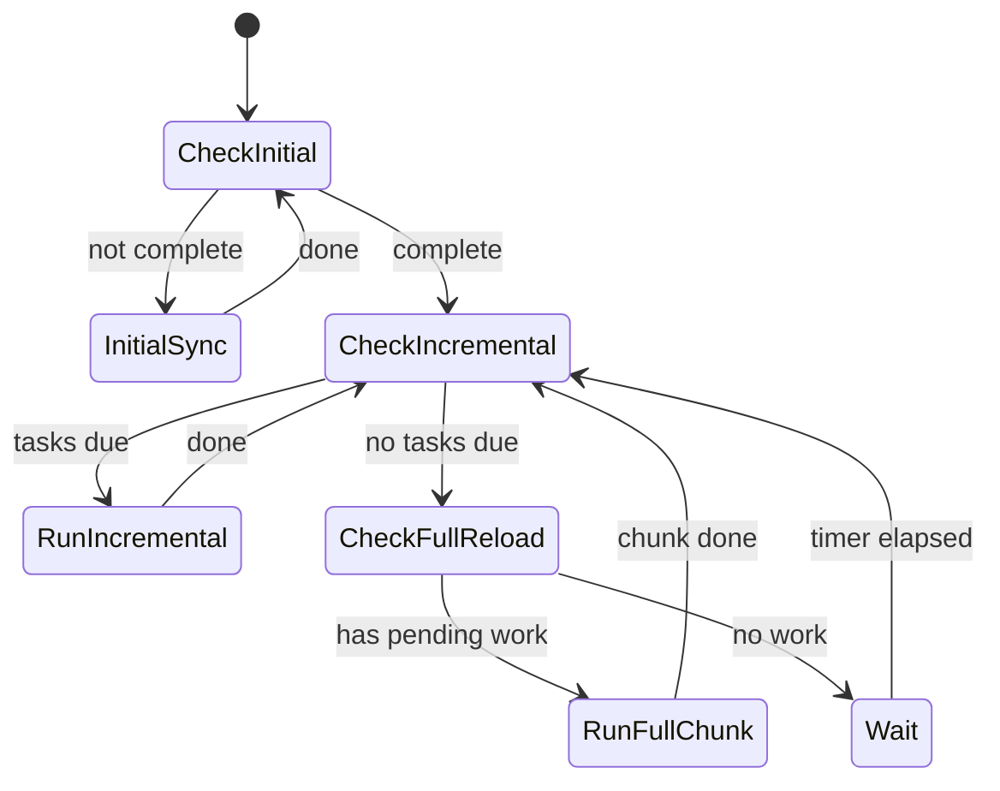

# Архитектура синхронизации с Business.ru

## Обзор

Система синхронизации построена на **приоритетной модели** с тремя уровнями:

| Приоритет | Название | Поведение |
|-----------|----------|-----------|
| 🔴 **HIGH** | Initial | Блокирующий. Ничего не делаем, пока не завершим |
| 🟡 **MEDIUM** | Incremental | По интервалам. Выполняется после инициальной |
| 🟢 **LOW** | Full Reload | Ленивый. В промежутках ожидания MEDIUM |

---

## Модель приоритетов

```
┌─────────────────────────────────────────────────────────────────┐
│ 🔴 HIGH: Initial Sync (блокирующий)                             │
├─────────────────────────────────────────────────────────────────┤
│ • Запускается один раз при первом старте                        │
│ • Блокирует все остальные операции                              │
│ • Включает: справочники → товары (все страницы) → изображения   │
│ • После завершения: Sync_InitialComplete = true                 │
└─────────────────────────────────────────────────────────────────┘
                              ↓
                    Initial complete?
                              ↓
┌─────────────────────────────────────────────────────────────────┐
│ 🟡 MEDIUM: Incremental Updates (по интервалам)                  │
├─────────────────────────────────────────────────────────────────┤
│ • Запрос изменений с момента последнего запроса                 │
│ • Интервалы: товары (1 мин), справочники (1 день)               │
│ • Параметры: updated[from], updated_remains_prices[from]        │
│ • Приоритет: всегда выполняется первым при наступлении срока    │
└─────────────────────────────────────────────────────────────────┘
                              ↓
                    Есть свободное время?
                              ↓
┌─────────────────────────────────────────────────────────────────┐
│ 🟢 LOW: Full Reload (ленивый, по частям)                        │
├─────────────────────────────────────────────────────────────────┤
│ • Выполняется в промежутках между MEDIUM                        │
│ • По частям (N страниц за раз), сохраняя прогресс               │
│ • Прерывается, если пришло время MEDIUM                         │
│ • Цель: полная консистентность раз в день                       │
└─────────────────────────────────────────────────────────────────┘
```

---

## Алгоритм главного цикла

```csharp
while (!stopping)
{
    // 🔴 HIGH: блокирующая инициализация
    if (!await IsInitialSyncCompleteAsync())
    {
        await RunInitialSyncAsync();  // Блокируем до завершения
        continue;
    }
    
    // 🟡 MEDIUM: проверяем, есть ли просроченные incremental задачи
    var pendingIncrementals = GetDueIncrementalTasks();
    if (pendingIncrementals.Any())
    {
        foreach (var task in pendingIncrementals)
            await task.ExecuteAsync();
        continue;  // После инкрементов проверяем снова
    }
    
    // 🟢 LOW: если всё выполнено — работаем над full reload
    if (HasPendingFullReloadWork())
    {
        await RunFullReloadChunkAsync();  // N страниц
        // Не ждём, сразу проверяем MEDIUM снова
        continue;
    }
    
    // Нет работы — ждём до следующего срока MEDIUM
    await WaitUntilNextIncrementalDueAsync();
}
```

---

## Incremental задачи (MEDIUM)

| Задача | Интервал | Источник времени |
|--------|----------|------------------|
| Goods Delta | 1 мин | `Sync_Goods_LastDelta` |
| Images Delta | 1 мин | `Sync_Images_LastDelta` |
| References | 1 день | `Sync_References_LastRun` |

**Логика проверки:**
```csharp
bool IsDue(task) => DateTime.UtcNow - task.LastRun >= task.Interval;
```

---

## Full Reload (LOW) — ленивая загрузка

**Проблема:** полная загрузка ~10,000 товаров занимает много времени.

**Решение:** загружаем по частям (chunks), сохраняя прогресс:

| Параметр | Значение | Описание |
|----------|----------|----------|
| `FullReload_Goods_CurrentPage` | int | Текущая страница |
| `FullReload_Goods_TotalPages` | int | Всего страниц |
| `FullReload_Goods_StartedAt` | DateTime | Когда начали текущий цикл |
| `FullReload_ChunkSize` | 5 | Страниц за одну итерацию |

```csharp
async Task RunFullReloadChunkAsync()
{
    var currentPage = await GetAsync("FullReload_Goods_CurrentPage");
    var totalPages = await GetAsync("FullReload_Goods_TotalPages");
    
    // Загружаем ChunkSize страниц
    for (int i = 0; i < ChunkSize && currentPage <= totalPages; i++)
    {
        await LoadGoodsPageAsync(currentPage++);
        await SetAsync("FullReload_Goods_CurrentPage", currentPage);
    }
    
    // Если завершили цикл — сбрасываем
    if (currentPage > totalPages)
    {
        await SetAsync("FullReload_Goods_CurrentPage", 1);
        await SetAsync("Sync_Goods_LastFull", DateTime.UtcNow);
    }
}
```

---

## Диаграмма состояний



---

## Структура компонентов

```
MarketplaceSyncer.Service/
├── Services/
│   ├── SyncOrchestrator.cs        # Главный цикл с приоритетами
│   ├── SyncStateRepository.cs     # Работа с app_settings
│   ├── Tasks/
│   │   ├── ISyncTask.cs           # Интерфейс задачи
│   │   ├── GoodsDeltaTask.cs      # Incremental товары
│   │   ├── ImagesDeltaTask.cs     # Incremental изображения
│   │   ├── ReferencesSyncTask.cs  # Справочники
│   │   └── GoodsFullReloadTask.cs # Полная загрузка по частям
│   ├── GoodsSyncer.cs             # Логика загрузки товаров
│   └── ImageSyncService.cs        # Изображения (готов)
└── Configuration/
    └── SynchronizationOptions.cs  # Интервалы
```

---

## Конфигурация

```json
"Synchronization": {
  "GoodsDeltaInterval": "00:01:00",
  "ImagesDeltaInterval": "00:01:00", 
  "ReferencesInterval": "1.00:00:00",
  "FullReloadChunkSize": 5,
  "FullReloadTargetInterval": "1.00:00:00"
}
```

